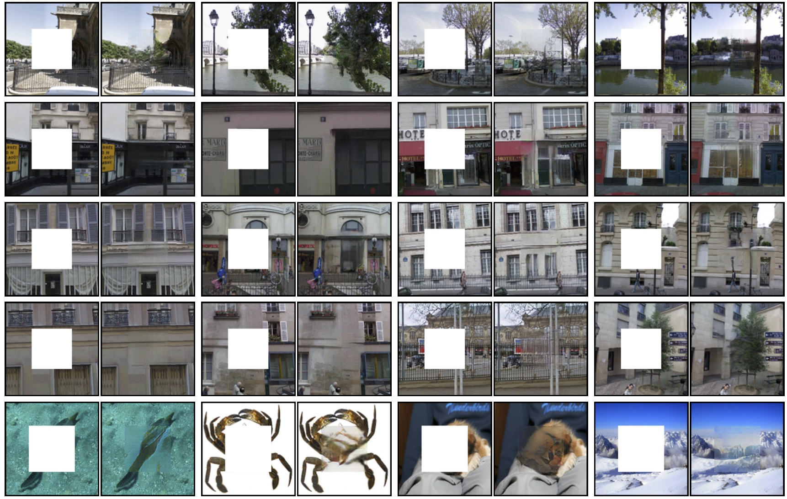

## Context Encoders: Feature Learning by Inpainting
#### CVPR 2016
#### [[Project Website]](https://www.cs.cmu.edu/~dpathak/context_encoder/) [[Imagenet Results]](https://www.cs.cmu.edu/~dpathak/context_encoder/#extraResults)
Sample results on held-out images: 



This is the training code for our [CVPR 2016 paper on Context Encoders](https://www.cs.cmu.edu/~dpathak/context_encoder/) for learning deep feature representation in an unsupervised manner by image inpainting. Context Encoders are trained jointly with reconstruction and adversarial loss. This repo contains quick demo, training/testing code for center region inpainting and training/testing code for arbitray random region inpainting. This code is adapted from an initial fork of [Soumith's DCGAN](https://github.com/soumith/dcgan.torch) implementation. Scroll down to try out a quick demo or train your own inpainting models!

If you find [Context Encoders](https://www.cs.cmu.edu/~dpathak/context_encoder/) useful in your research, please cite:

    @inproceedings{pathakCVPR16context,
        Author = {Pathak, Deepak and Kr\"ahenb\"uhl, Philipp and Donahue, Jeff and Darrell, Trevor and Efros, Alexei},
        Title = {Context Encoders: Feature Learning by Inpainting},
        Booktitle = {Computer Vision and Pattern Recognition ({CVPR})},
        Year = {2016}
    }

### Contents
1. [Semantic Inpainting Demo](#1-semantic-inpainting-demo)
2. [Train Context Encoders](#2-train-context-encoders)
3. [Download Features Caffemodel](#3-download-features-caffemodel)
4. [TensorFlow Implementation](#4-tensorflow-implementation)
5. [Project Website](#5-project-website)
6. [Download Dataset](#6-paris-street-view-dataset)

### 1) Semantic Inpainting Demo

1. Install Torch:  http://torch.ch/docs/getting-started.html#_

2. Clone the repository
  ```Shell
  git clone https://github.com/pathak22/context-encoder.git
  ```
  
3. Demo
  ```Shell
  cd context-encoder
  bash ./models/scripts/download_inpaintCenter_models.sh
  # This will populate the `./models/` folder with trained models.

  net=models/inpaintCenter/paris_inpaintCenter.t7 name=paris_result imDir=images/paris overlapPred=4 manualSeed=222 batchSize=21 gpu=1 th demo.lua
  net=models/inpaintCenter/imagenet_inpaintCenter.t7 name=imagenet_result imDir=images/imagenet overlapPred=4 manualSeed=222 batchSize=21 gpu=1 th demo.lua
  net=models/inpaintCenter/paris_inpaintCenter.t7 name=ucberkeley_result imDir=images/ucberkeley overlapPred=4 manualSeed=222 batchSize=4 gpu=1 th demo.lua
  # Note: If you are running on cpu, use gpu=0
  # Note: samples given in ./images/* are held-out images
  ```

### 2) Train Context Encoders

If you could successfully run the above demo, run following steps to train your own context encoder model for image inpainting.

0. [Optional] Install Display Package as follows. If you don't want to install it, then set `display=0` in `train.lua`.
  ```Shell
  luarocks install https://raw.githubusercontent.com/szym/display/master/display-scm-0.rockspec
  cd ~
  th -ldisplay.start 8000
  # if working on server machine create tunnel: ssh -f -L 8000:localhost:8000 -N server_address.com
  # on client side, open in browser: http://localhost:8000/
  ```

1. Make the dataset folder.
  ```Shell
  mkdir -p /path_to_wherever_you_want/mydataset/train/images/
  # put all training images inside mydataset/train/images/
  mkdir -p /path_to_wherever_you_want/mydataset/val/images/
  # put all val images inside mydataset/val/images/
  cd context-encoder/
  ln -sf /path_to_wherever_you_want/mydataset dataset
  ```

2. Train the model
  ```Shell
  # For training center region inpainting model, run:
  DATA_ROOT=dataset/train display_id=11 name=inpaintCenter overlapPred=4 wtl2=0.999 nBottleneck=4000 niter=500 loadSize=350 fineSize=128 gpu=1 th train.lua

  # For training random region inpainting model, run:
  DATA_ROOT=dataset/train display_id=11 name=inpaintRandomNoOverlap useOverlapPred=0 wtl2=0.999 nBottleneck=4000 niter=500 loadSize=350 fineSize=128 gpu=1 th train_random.lua
  # or use fineSize=64 to train to generate 64x64 sized image (results are better):
  DATA_ROOT=dataset/train display_id=11 name=inpaintRandomNoOverlap useOverlapPred=0 wtl2=0.999 nBottleneck=4000 niter=500 loadSize=350 fineSize=64 gpu=1 th train_random.lua
  ```

3. Test the model
  ```Shell
  # For training center region inpainting model, run:
  DATA_ROOT=dataset/val net=checkpoints/inpaintCenter_500_net_G.t7 name=test_patch overlapPred=4 manualSeed=222 batchSize=30 loadSize=350 gpu=1 th test.lua
  DATA_ROOT=dataset/val net=checkpoints/inpaintCenter_500_net_G.t7 name=test_full overlapPred=4 manualSeed=222 batchSize=30 loadSize=129 gpu=1 th test.lua

  # For testing random region inpainting model, run (with fineSize=64 or 124, same as training):
  DATA_ROOT=dataset/val net=checkpoints/inpaintRandomNoOverlap_500_net_G.t7 name=test_patch_random useOverlapPred=0 manualSeed=222 batchSize=30 loadSize=350 gpu=1 th test_random.lua
  DATA_ROOT=dataset/val net=checkpoints/inpaintRandomNoOverlap_500_net_G.t7 name=test_full_random useOverlapPred=0 manualSeed=222 batchSize=30 loadSize=129 gpu=1 th test_random.lua
  ```

### 3) Download Features Caffemodel

Features for context encoder trained with reconstruction loss.

- [Prototxt](https://www.cs.cmu.edu/~dpathak/context_encoder/resources/ce_features.prototxt)
- [Caffemodel](https://www.cs.cmu.edu/~dpathak/context_encoder/resources/ce_features.caffemodel)

### 4) TensorFlow Implementation

Checkout the TensorFlow implementation of our paper by Taeksoo [here](https://github.com/jazzsaxmafia/Inpainting). However, it does not implement full functionalities of our paper.

### 5) Project Website

Click [here](https://www.cs.cmu.edu/~dpathak/context_encoder/).

### 6) Paris Street-View Dataset

Please email me if you need the dataset and I will share a private link with you. I can't post the public link to this dataset due to the policy restrictions from Google Street View.
